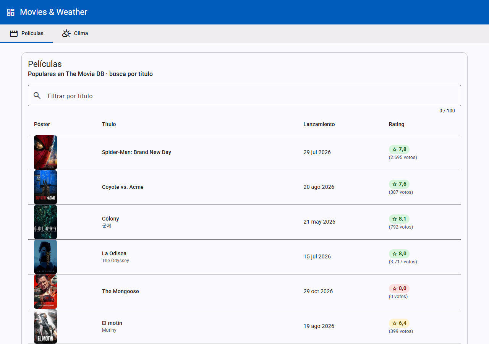
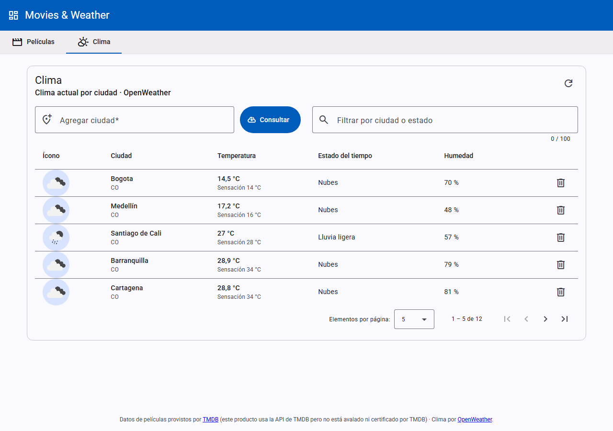
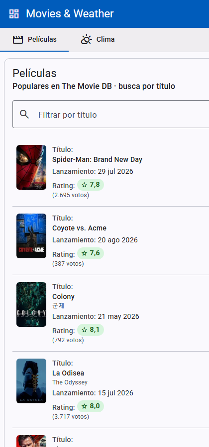

# Movies & Weather — Prueba técnica Angular

[](https://github.com/No-az/angular-tmdb-weather/actions/workflows/ci.yml)

**Demo en vivo:** <https://no-az.github.io/angular-tmdb-weather/>

| Películas (TMDB) | Clima (OpenWeather) |
|------------------|---------------------|
|  |  |

En móvil cada fila se convierte en una tarjeta:



Aplicación Angular que consume dos APIs públicas y las presenta en tablas con Angular Material:

| Tab | API | Datos mostrados | Paginación / filtro |
|-----|-----|-----------------|---------------------|
| **Películas** | [The Movie DB (TMDB)](https://developer.themoviedb.org/) | Póster, título, fecha de lanzamiento, rating | Servidor: `/movie/popular` y `/search/movie` (filtro por título) |
| **Clima** | [OpenWeather](https://openweathermap.org/current) | Ícono, ciudad, temperatura, estado del tiempo, humedad | Cliente: `MatTableDataSource` (filtro, orden y paginación) + formulario para agregar ciudades |

## Stack

- Angular 20 (standalone components, signals, control flow `@if/@for`)
- Angular Material 20 (Material 3): `mat-table`, `mat-paginator`, `mat-sort`, `mat-form-field`, `mat-tab-nav-bar`, `mat-snack-bar`, `mat-progress-spinner`, `mat-card`
- RxJS, Reactive Forms
- Jasmine + Karma para tests unitarios
- `angular-cli-ghpages` para despliegue en GitHub Pages

## Requisitos previos

- Node.js **20.19+ o 22.12+** y npm 10+
- (Opcional) Angular CLI global: `npm install -g @angular/cli@20` — no es obligatorio, los scripts usan el CLI local.
- Google Chrome (solo para ejecutar los tests con Karma)

## 1. Obtener las API keys

| Variable | Dónde obtenerla |
|----------|-----------------|
| `TMDB_API_KEY` | Crea una cuenta en [themoviedb.org](https://www.themoviedb.org/signup) → **Settings → API** ([enlace directo](https://www.themoviedb.org/settings/api)) → solicita una API key de tipo *Developer* → copia el valor **"API Key"** (v3, 32 caracteres). *No* uses el "API Read Access Token". |
| `OPENWEATHER_API_KEY` | Crea una cuenta en [openweathermap.org](https://home.openweathermap.org/users/sign_up) → **My API keys** ([enlace directo](https://home.openweathermap.org/api_keys)). El plan gratuito es suficiente. ⚠️ Una key nueva puede tardar hasta 2 horas en activarse (mientras tanto responde 401). |

## 2. Instalación y configuración

```bash
git clone <url-del-repo>
cd angular-tmdb-weather
npm install
```

Crea el archivo `.env` a partir de la plantilla y pega tus claves:

```bash
cp .env.example .env        # En PowerShell: Copy-Item .env.example .env
```

```dotenv
TMDB_API_KEY=tu_api_key_de_tmdb
OPENWEATHER_API_KEY=tu_api_key_de_openweather
```

### ¿Cómo llegan las claves a Angular?

Angular se ejecuta en el navegador y no lee `.env` por sí mismo. El script [`scripts/set-env.mjs`](scripts/set-env.mjs) lee `.env` (o las variables de entorno del sistema, útil en CI) y **genera** `src/environments/environment.ts`, tipado con la interfaz `Environment`.

- Se ejecuta automáticamente antes de `npm start`, `npm run build` y `npm test` (hooks `prestart`, `prebuild`, `pretest`).
- Manualmente: `npm run config`.
- Tanto `.env` como `src/environments/environment.ts` están en `.gitignore`: **las claves nunca se versionan**.
- Alternativa sin `.env`: ejecuta `npm run config` una vez y edita a mano `src/environments/environment.ts`; el script no lo sobrescribe si no encuentra claves.

## 3. Ejecutar en desarrollo

```bash
npm start
```

Abre <http://localhost:4200>. (Si usas `ng serve` directamente, ejecuta antes `npm run config`).

## 4. Build de producción

```bash
npm run build
```

El resultado queda en `dist/angular-tmdb-weather/browser`.

## 5. Tests unitarios (Jasmine + Karma)

```bash
npm test            # modo watch, abre Chrome
npm run test:ci     # una sola ejecución en Chrome headless
```

Cobertura actual (14 specs):

| Archivo | Qué valida |
|---------|------------|
| `services/movie.service.spec.ts` | Endpoint popular vs. búsqueda, parámetros, límite de 500 páginas |
| `services/weather.service.spec.ts` | Mapeo `CurrentWeatherResponse → CityWeather`, tolerancia a ciudades que fallan |
| `features/movies/components/movie-table/movie-table.component.spec.ts` | Render de filas, póster/placeholder, estado vacío, evento de paginación |
| `core/interceptors/http-error.interceptor.spec.ts` | Snackbar ante 401/404 y re-lanzamiento del error |
| `app.component.spec.ts` | Tabs de navegación entre features |

## 6. Despliegue en GitHub Pages

El proyecto ya incluye `angular-cli-ghpages` y el target `deploy` en `angular.json`.

1. Crea un repositorio en GitHub llamado **`angular-tmdb-weather`** y sube el código (`git remote add origin ...` y `git push`).
   - Si usas otro nombre de repositorio, cambia `/angular-tmdb-weather/` en los scripts `build:gh-pages` y `deploy:gh-pages` de `package.json`.
2. Asegúrate de tener el `.env` con tus claves.
3. Despliega:

   ```bash
   npm run deploy:gh-pages
   ```

   Equivale a `ng deploy --base-href=/angular-tmdb-weather/`: compila en producción con el `base-href` correcto, crea `404.html` (para que las rutas `/movies` y `/weather` funcionen al recargar) y publica en la rama `gh-pages`.
4. En GitHub: **Settings → Pages → Source: Deploy from a branch → `gh-pages` / root**.
5. La app queda en `https://<tu-usuario>.github.io/angular-tmdb-weather/`.

Solo compilar con el base-href (sin publicar): `npm run build:gh-pages`.

> ⚠️ **Sobre las claves en producción:** en una SPA estática las API keys terminan dentro del bundle JavaScript público (no hay backend que las oculte). Para una prueba técnica es aceptable con keys gratuitas; en un producto real se usaría un backend/proxy.

## Arquitectura

```
src/
├── environments/
│   ├── environment.model.ts      # Interfaz tipada de configuración (versionada)
│   └── environment.ts            # Generado desde .env (ignorado por git)
└── app/
    ├── app.component.*           # Shell: toolbar + tabs (mat-tab-nav-bar) + router-outlet
    ├── app.config.ts             # Providers: router, HttpClient + interceptor, locale es, paginador en español
    ├── app.routes.ts             # Lazy loading de /movies y /weather
    ├── core/                     # Singletons transversales
    │   ├── i18n/                 # MatPaginatorIntl en español
    │   ├── interceptors/         # httpErrorInterceptor → snackbar
    │   └── services/             # NotificationService (MatSnackBar)
    ├── shared/                   # Reutilizables sin lógica de negocio
    │   ├── components/           # search-field, loading-overlay
    │   └── pipes/                # tmdbImage (URL de pósters)
    ├── models/                   # Interfaces que reflejan las respuestas de TMDB y OpenWeather
    ├── services/                 # Consumo de APIs (MovieService, WeatherService)
    └── features/
        ├── movies/
        │   ├── movies.routes.ts
        │   ├── pages/movies-page/        # Contenedor: estado + llamadas al servicio
        │   └── components/movie-table/  # Presentación: inputs/outputs, sin servicios
        └── weather/
            ├── weather.routes.ts
            ├── weather.constants.ts     # Ciudades del dataset inicial
            ├── pages/weather-page/      # Contenedor
            └── components/              # weather-table, add-city-form (presentación)
```

### Decisiones de diseño

- **Standalone components:** desde Angular 19 todo componente es standalone por defecto (no hay `NgModule`s); cada componente declara sus propios `imports`.
- **Contenedor vs. presentación:** las *pages* inyectan servicios y manejan estado con `signal()`; los *components* solo reciben `input()` y emiten `output()`, lo que los hace fáciles de testear.
- **Tipado estricto:** `strict: true` + `strictTemplates`. Los modelos de `models/` reflejan los JSON de cada API; `CityWeather` es un modelo de vista para no acoplar la tabla a la respuesta cruda. No se usa `any`.
- **Errores HTTP:** `httpErrorInterceptor` traduce el status (0, 401, 404, 429, 5xx) a un mensaje en español, lo muestra con `MatSnackBar` y re-lanza el error; los contenedores usan `catchError` para dejar la vista en un estado consistente.
- **Loading:** cada feature tiene su propio `loading` signal y un overlay con `mat-spinner` sobre la tabla.
- **Búsqueda:** `debounceTime` + `distinctUntilChanged` en el campo y `switchMap` en el contenedor para cancelar peticiones obsoletas.
- **Responsive:** en pantallas < 600px las tablas se transforman en tarjetas (CSS con `data-label`), y los formularios se apilan en una columna.
